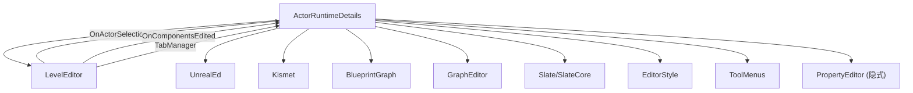
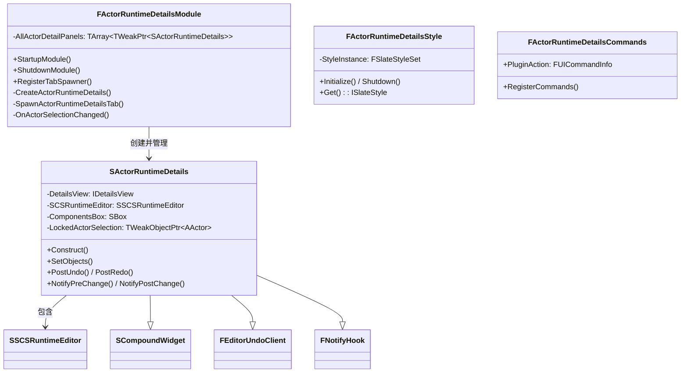
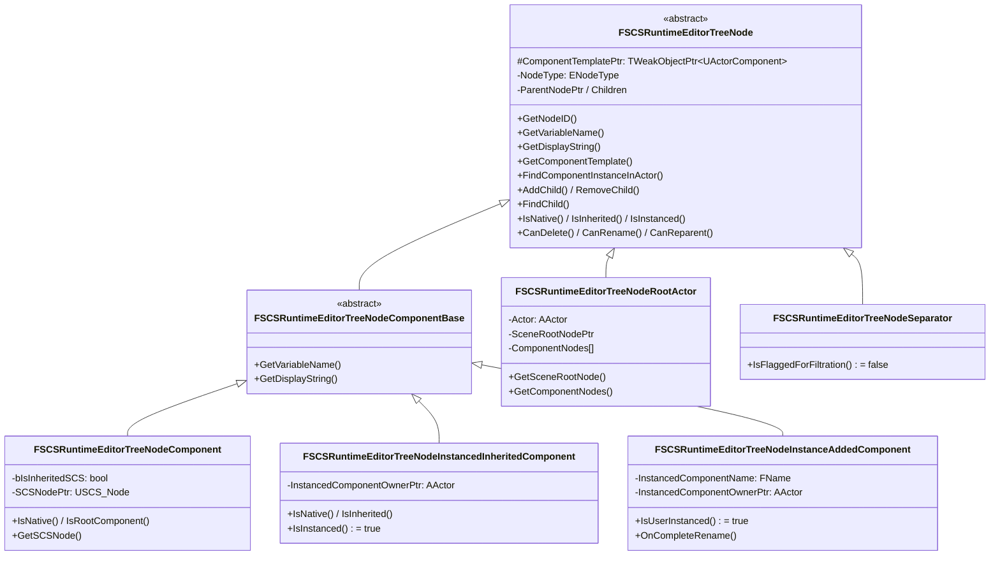
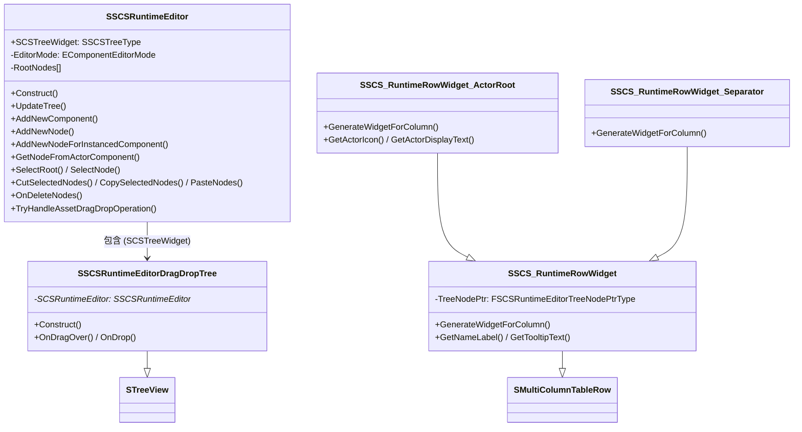
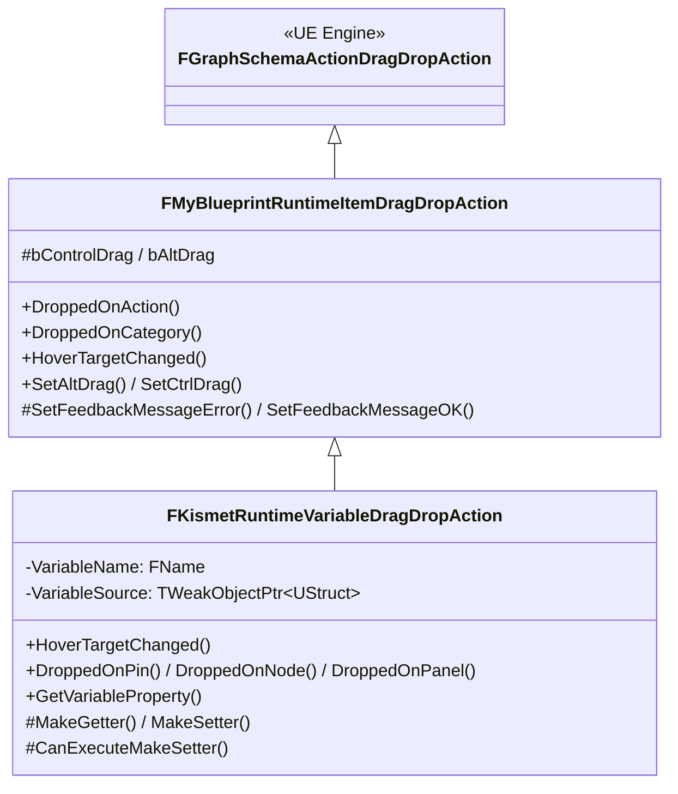
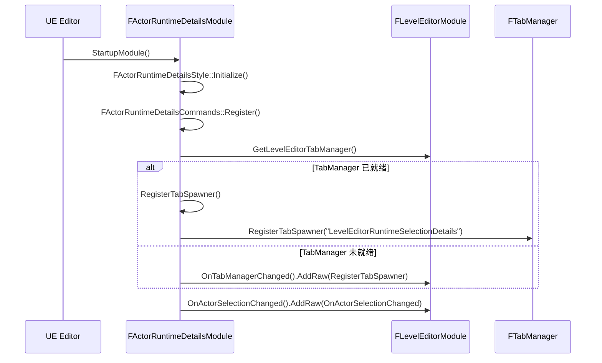
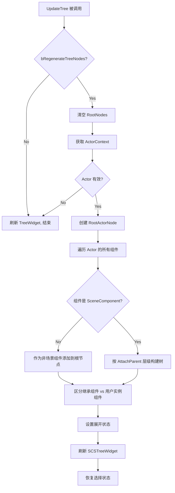
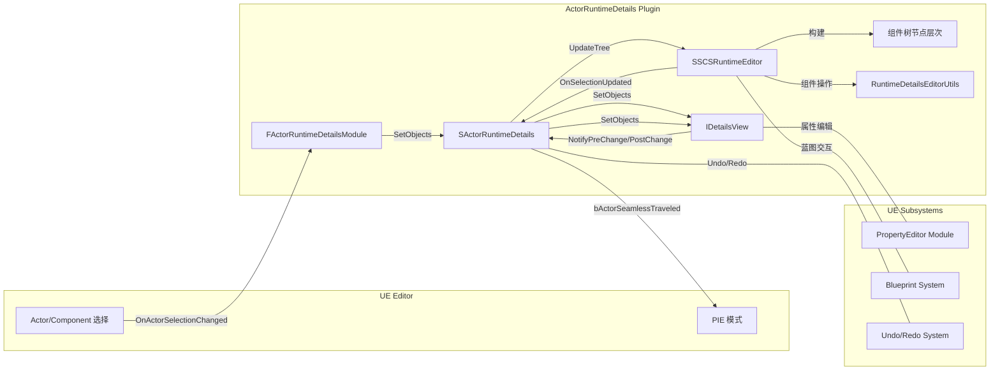

# ActorRuntimeDetails 插件 — 代码架构文档

> **版本**：1.0  
> **最后更新**：2026-04-15  
> **适用引擎**：UE 5.3.2（原始代码基于 UE4 开发）

---

## 1. 插件概览

`ActorRuntimeDetails` 是一个 **Editor-Only** 插件，用于在 **PIE（Play In Editor）模式** 下，实时查看和编辑选中 Actor 及其 ActorComponent 的属性。

### 核心能力

| 能力 | 说明 |
|------|------|
| 运行时属性查看 | PIE 模式下选中 Actor 后，在独立面板中展示其全部属性 |
| 运行时属性编辑 | 直接在面板中修改运行时 Actor/Component 的属性值，立即生效 |
| 组件树浏览 | 以树形结构展示 Actor 的完整组件层级（继承组件 + 实例组件） |
| 组件选择联动 | 面板中的组件选择与编辑器视口中的组件选择双向同步 |
| 蓝图变量拖放 | 支持从 MyBlueprint 面板拖放变量到蓝图图表中 |

### 插件元信息（.uplugin）

```json
{
  "Name": "ActorRuntimeDetails",
  "Type": "Editor",
  "LoadingPhase": "PostEngineInit",
  "EnabledByDefault": true
}
```

- **模块类型**：`Editor`（仅在编辑器中加载，不参与打包）
- **加载阶段**：`PostEngineInit`（引擎初始化完成后加载，确保 LevelEditor 等模块可用）

---

## 2. 文件结构

```
ActorRuntimeDetails/
├── ActorRuntimeDetails.uplugin              # 插件描述文件
├── Resources/                                # 资源文件（图标等）
├── Docs/                                     # 文档目录
└── Source/ActorRuntimeDetails/
    ├── ActorRuntimeDetails.Build.cs          # 模块构建配置
    ├── Public/                               # 公开头文件
    │   ├── ARDUEFeatures.h                   # UE 版本条件编译宏定义
    │   ├── ActorRuntimeDetailsModule.h       # 模块入口类声明
    │   ├── ActorRuntimeDetailsStyle.h        # Slate 样式管理类声明
    │   ├── ActorRuntimeDetailsCommands.h     # UI 命令注册类声明
    │   └── SSCSRuntimeEditorMenuContext.h    # 右键菜单上下文 UObject
    └── Private/                              # 私有实现文件
        ├── ActorRuntimeDetailsModule.cpp     # 模块启动/关闭、Tab 注册
        ├── ActorRuntimeDetailsStyle.cpp      # Slate 样式创建与注册
        ├── ActorRuntimeDetailsCommands.cpp   # UI 命令注册实现
        ├── SActorRuntimeDetails.h/.cpp       # 运行时 Actor 详情面板 Widget
        ├── SSCSRuntimeEditor.h/.cpp          # 组件树编辑器（核心大文件，~6900行/~1200行）
        ├── RuntimeDetailsEditorUtils.h/.cpp  # 组件操作辅助工具函数
        ├── BPRuntimeVariableDragDropAction.h/.cpp    # 蓝图变量拖放操作
        └── MyBlueprintRuntimeItemDragDropAction.h/.cpp # MyBlueprint 项拖放基类
```

### 文件规模

| 文件 | 行数 | 说明 |
|------|------|------|
| `SSCSRuntimeEditor.cpp` | ~6915 | 核心大文件，组件树编辑器全部逻辑 |
| `SSCSRuntimeEditor.h` | ~1225 | 组件树编辑器类层次定义 |
| `SActorRuntimeDetails.cpp` | ~864 | 详情面板 Widget 实现 |
| `BPRuntimeVariableDragDropAction.cpp` | ~478 | 蓝图变量拖放逻辑 |
| `RuntimeDetailsEditorUtils.cpp` | ~220 | 工具函数 |
| 其余文件 | <180 | 模块入口、样式、命令等 |

---

## 3. 模块依赖关系

### Build.cs 依赖模块

```
Public:  Core
Private: Projects, InputCore, UnrealEd, LevelEditor, CoreUObject, Engine,
         Slate, SlateCore, WorkspaceMenuStructure, EditorStyle, Kismet,
         BlueprintGraph, GraphEditor, ToolMenus
```

### 依赖关系图



---

## 4. 类层次结构

### 4.1 模块与面板层



### 4.2 组件树节点层次



**节点类型说明**：

| 节点类型 | 类名 | 用途 |
|----------|------|------|
| `RootActorNode` | `FSCSRuntimeEditorTreeNodeRootActor` | 树的根节点，代表 Actor 本身 |
| `ComponentNode` (SCS) | `FSCSRuntimeEditorTreeNodeComponent` | 非实例模式下的 SCS 节点或原生组件 |
| `ComponentNode` (继承实例) | `FSCSRuntimeEditorTreeNodeInstancedInheritedComponent` | 实例模式下的继承组件（原生或 SCS 继承） |
| `ComponentNode` (用户实例) | `FSCSRuntimeEditorTreeNodeInstanceAddedComponent` | 实例模式下用户运行时新增的组件 |
| `SeparatorNode` | `FSCSRuntimeEditorTreeNodeSeparator` | 树中的分隔符节点 |

### 4.3 组件树编辑器与行 Widget



### 4.4 拖放操作层次



---

## 5. 核心流程

### 5.1 插件启动与 Tab 注册



### 5.2 Actor 选择 → 面板更新

```mermaid
sequenceDiagram
    participant User as 用户
    participant Editor as UE Editor
    participant Module as FActorRuntimeDetailsModule
    participant Panel as SActorRuntimeDetails
    participant SCS as SSCSRuntimeEditor
    participant Details as IDetailsView

    User->>Editor: 在 PIE 模式下选中 Actor
    Editor->>Module: OnActorSelectionChanged(NewSelection)
    Module->>Panel: SetObjects(InObjects)
    
    alt PlayWorld == nullptr
        Panel-->>Panel: return (非 PIE 模式不处理)
    else PIE 模式
        Panel->>Details: SetObjects(InObjects)
        Panel->>Panel: 判断是否显示组件树
        alt 单个 Actor 且可创建蓝图
            Panel->>SCS: UpdateTree()
            Panel->>Panel: ComponentsBox.SetVisibility(Visible)
        else
            Panel->>Panel: ComponentsBox.SetVisibility(Collapsed)
        end
    end
```

### 5.3 组件树构建流程（UpdateTree）



### 5.4 组件树选择 → 属性面板联动

```mermaid
sequenceDiagram
    participant User as 用户
    participant Tree as SSCSRuntimeEditor
    participant Panel as SActorRuntimeDetails
    participant Details as IDetailsView
    participant Editor as GEditor

    User->>Tree: 点击组件树节点
    Tree->>Panel: OnSelectionUpdated(SelectedNodes)
    Panel->>Panel: OnSCSRuntimeEditorTreeViewSelectionChanged()
    
    alt 选中 RootActorNode
        Panel->>Details: SetObjects([Actor])
    else 选中 ComponentNode(s)
        Panel->>Panel: FindComponentInstanceInActor()
        Panel->>Details: SetObjects([Components...])
        Panel->>Editor: GetSelectedComponents().Select(Component)
    end
    
    Panel->>Editor: SetActorSelectionFlags(Actor)
    Panel->>Editor: UpdatePivotLocationForSelection()
    Panel->>Editor: RedrawLevelEditingViewports()
```

### 5.5 属性编辑通知流程

```mermaid
sequenceDiagram
    participant User as 用户
    participant Details as IDetailsView
    participant Panel as SActorRuntimeDetails (FNotifyHook)
    participant Actor as AActor

    User->>Details: 修改属性值
    Details->>Panel: NotifyPreChange(PropertyAboutToChange)
    Panel->>Actor: bActorSeamlessTraveled = true
    Note over Panel,Actor: 阻止 Actor 重建
    
    Details->>Details: 应用属性修改
    
    Details->>Panel: NotifyPostChange(PropertyChangedEvent, PropertyThatChanged)
    Panel->>Actor: bActorSeamlessTraveled = false
    Note over Panel,Actor: 恢复正常状态
```

> **关键设计**：通过设置 `bActorSeamlessTraveled = true` 来阻止属性修改触发 Actor 的 Construction Script 重新执行，从而避免运行时 Actor 被重建。

---

## 6. 关键类详解

### 6.1 FActorRuntimeDetailsModule

**文件**：`ActorRuntimeDetailsModule.h/.cpp`  
**职责**：插件生命周期管理

| 方法 | 职责 |
|------|------|
| `StartupModule()` | 初始化样式、注册命令、注册 Tab Spawner、绑定选择变更事件 |
| `ShutdownModule()` | 清理样式、注销命令 |
| `RegisterTabSpawner()` | 向 LevelEditor 的 TabManager 注册 "Runtime Details" Tab |
| `SpawnActorRuntimeDetailsTab()` | 创建 Tab 内容（`SActorRuntimeDetails` Widget） |
| `CreateActorRuntimeDetails()` | 构造 `SActorRuntimeDetails` 并立即用当前选中 Actor 初始化 |
| `OnActorSelectionChanged()` | 广播选择变更到所有已创建的详情面板 |

**设计要点**：
- 使用 `AllActorDetailPanels` (TArray<TWeakPtr>) 管理多个面板实例
- Tab 注册使用 `LevelEditorRuntimeSelectionDetails` 作为唯一标识

### 6.2 SActorRuntimeDetails

**文件**：`SActorRuntimeDetails.h/.cpp`  
**职责**：运行时 Actor 详情面板的顶层 Widget

**组合关系**：
```
SActorRuntimeDetails (SCompoundWidget)
├── TextBlock ("Play game in editor." 提示)
├── DetailsView->GetNameAreaWidget()
├── DetailsSplitter (SSplitter, 垂直方向)
│   ├── Slot[0]: ComponentsBox (SBox)
│   │   └── SSCSRuntimeEditor (组件树)
│   └── Slot[1]: 
│       ├── UCS/Inherited/Native 组件警告
│       ├── DetailsView->GetFilterAreaWidget()
│       └── DetailsView (IDetailsView, 属性编辑器)
```

**实现的接口**：
- `FEditorUndoClient`：响应 Undo/Redo，刷新组件树
- `FNotifyHook`：拦截属性修改前后事件，控制 Actor 重建行为

**关键状态**：
- `bSelectionGuard`：防止选择变更的重入
- `bShowingRootActorNodeSelected`：跟踪是否选中了 Actor 根节点
- `LockedActorSelection`：面板锁定时记住的 Actor

### 6.3 SSCSRuntimeEditor

**文件**：`SSCSRuntimeEditor.h/.cpp`（核心大文件）  
**职责**：组件树编辑器，管理组件的树形展示、选择、拖放、增删改

**编辑器模式**（`EComponentEditorMode`）：
- `BlueprintSCS`：编辑蓝图的 SCS（本插件未使用此模式）
- `ActorInstance`：编辑 Actor 实例（本插件的主要模式）

**核心功能分组**：

| 功能组 | 关键方法 |
|--------|----------|
| 树构建 | `UpdateTree()`, `AddTreeNode()`, `AddTreeNodeFromComponent()` |
| 节点查找 | `FindTreeNode()`, `GetNodeFromActorComponent()` |
| 组件增删 | `AddNewComponent()`, `AddNewNode()`, `AddNewNodeForInstancedComponent()`, `OnDeleteNodes()` |
| 剪贴板 | `CutSelectedNodes()`, `CopySelectedNodes()`, `PasteNodes()`, `OnDuplicateComponent()` |
| 选择管理 | `OnTreeSelectionChanged()`, `SelectRoot()`, `SelectNode()`, `ClearSelection()` |
| 拖放处理 | `TryHandleAssetDragDropOperation()` |
| 右键菜单 | `CreateContextMenu()`, `RegisterContextMenu()`, `PopulateContextMenu()` |
| 蓝图交互 | `OnOpenBlueprintEditor()`, `OnApplyChangesToBlueprint()`, `PromoteToBlueprint()` |
| 过滤 | `OnFilterTextChanged()`, `RefreshFilteredState()` |

### 6.4 FSCSRuntimeEditorTreeNode 层次

**职责**：组件树中每个节点的数据模型

**工厂方法**：`FSCSRuntimeEditorTreeNode::FactoryNodeFromComponent(UActorComponent*)` 根据组件类型自动创建正确的节点子类。

**节点类型判断逻辑**：

```
FactoryNodeFromComponent(Component)
├── 如果 Component 来自 SCS 或是原生组件
│   └── 创建 FSCSRuntimeEditorTreeNodeInstancedInheritedComponent
└── 如果 Component 是运行时用户添加的
    └── 创建 FSCSRuntimeEditorTreeNodeInstanceAddedComponent
```

### 6.5 SSCS_RuntimeRowWidget

**职责**：组件树中每一行的 UI 渲染

**列定义**：
- `ComponentClass`：组件图标 + 名称（支持内联编辑重命名）
- `Asset`：关联资源名称
- `Mobility`：移动性图标

**特化子类**：
- `SSCS_RuntimeRowWidget_ActorRoot`：Actor 根节点行（显示 Actor 图标、类名、父类等）
- `SSCS_RuntimeRowWidget_Separator`：分隔符行

### 6.6 RuntimeDetailsEditorUtils

**文件**：`RuntimeDetailsEditorUtils.h/.cpp`  
**职责**：组件操作的静态工具函数

| 方法 | 职责 |
|------|------|
| `DeleteComponents()` | 删除组件并确定删除后应选中的组件 |
| `RenameComponentTemplate()` | 重命名组件模板 |
| `IsComponentNameAvailable()` | 检查组件名称是否可用 |
| `GetRelativeLocation/Rotation/Scale3D()` | 获取组件相对变换（封装了 UE4/UE5 API 差异） |
| `SetRelativeLocation/Rotation/Scale3D()` | 设置组件相对变换 |
| `IsUsingAbsoluteLocation/Rotation/Scale()` | 查询绝对变换标志 |

> **注意**：此文件大量使用 `#if UE_4_24_OR_LATER` 条件编译来兼容 UE4 不同版本的 API。

### 6.7 拖放操作类

**FMyBlueprintRuntimeItemDragDropAction**（基类）：
- 处理 MyBlueprint 面板项的通用拖放逻辑
- 支持拖放到 Action、Category 上
- 提供错误/成功反馈消息

**FKismetRuntimeVariableDragDropAction**（派生类）：
- 专门处理蓝图变量的拖放
- 支持拖放到 Pin、Node、Panel 上
- 自动创建 Getter/Setter 节点（Ctrl-drag / Alt-drag）
- 检查变量类型兼容性和作用域

### 6.8 USSCSRuntimeEditorMenuContext

**文件**：`SSCSRuntimeEditorMenuContext.h`  
**职责**：右键菜单的上下文 UObject，用于 ToolMenus 系统

```cpp
UCLASS()
class USSCSRuntimeEditorMenuContext : public UObject
{
    TWeakPtr<SSCSRuntimeEditor> SCSRuntimeEditor;
    bool bOnlyShowPasteOption;
};
```

---

## 7. 数据流总览



---

## 8. 版本兼容层

### ARDUEFeatures.h

该文件定义了一系列 UE4 版本条件编译宏：

```cpp
#define UE_4_16_OR_LATER (ENGINE_MAJOR_VERSION == 4 && ENGINE_MINOR_VERSION >= 16)
// ... 直到
#define UE_4_25_OR_LATER (ENGINE_MAJOR_VERSION == 4 && ENGINE_MINOR_VERSION >= 25)
```

**问题**：这些宏在 UE5 中全部求值为 `false`（因为 `ENGINE_MAJOR_VERSION == 5`），导致大量代码走入错误的分支。

**影响范围**：

| 文件 | 使用次数 | 主要影响 |
|------|----------|----------|
| `Build.cs` | 1 处 | `ToolMenus` 模块依赖 |
| `SSCSRuntimeEditor.h` | 2 处 | `UToolMenu` 前向声明、右键菜单方法 |
| `SSCSRuntimeEditor.cpp` | 2 处 | `ToolMenus.h` 包含、菜单注册 |
| `RuntimeDetailsEditorUtils.cpp` | 12 处 | 组件变换 API 封装 |
| `ActorRuntimeDetailsModule.cpp` | 1 处 | Widget/DockTab 头文件包含 |

---

## 9. 设计模式与架构特点

### 9.1 观察者模式
- `FActorRuntimeDetailsModule` 监听 `LevelEditor.OnActorSelectionChanged` 和 `LevelEditor.OnComponentsEdited`
- `SActorRuntimeDetails` 监听 `USelection::SelectionChangedEvent`
- 蓝图组件编译事件通过 `UBlueprint::OnCompiled()` 委托

### 9.2 组合模式
- 组件树使用 `FSCSRuntimeEditorTreeNode` 的树形结构，每个节点可包含子节点
- 通过 `AddChild()` / `RemoveChild()` / `FindChild()` 管理层级

### 9.3 工厂模式
- `FSCSRuntimeEditorTreeNode::FactoryNodeFromComponent()` 根据组件类型创建对应的节点子类
- `MakeTableRowWidget()` 根据节点类型创建对应的行 Widget

### 9.4 策略模式
- `EComponentEditorMode` 控制编辑器行为（BlueprintSCS vs ActorInstance）
- 不同节点类型通过虚函数多态实现不同的编辑行为（CanDelete, CanRename 等）

### 9.5 防重入保护
- `bSelectionGuard`：防止选择变更事件的循环触发
- `bUpdatingSelection`：防止选择更新过程中的重入
- `bAllowTreeUpdates`：控制树更新的开关

### 9.6 运行时属性编辑的关键技巧
- 通过 `FNotifyHook` 接口拦截属性修改事件
- 在 `NotifyPreChange` 中设置 `bActorSeamlessTraveled = true` 阻止 Actor 重建
- 在 `NotifyPostChange` 中恢复 `bActorSeamlessTraveled = false`
- 这确保了运行时属性修改不会触发 Construction Script 重新执行

---

## 10. 扩展与维护指南

### 10.1 添加新的组件节点类型
1. 继承 `FSCSRuntimeEditorTreeNodeComponentBase`
2. 实现必要的虚函数（`IsNative()`, `CanEditDefaults()` 等）
3. 在 `FactoryNodeFromComponent()` 中添加创建逻辑
4. 如需自定义行 UI，可继承 `SSCS_RuntimeRowWidget`

### 10.2 添加新的右键菜单项
1. 在 `SSCSRuntimeEditor::PopulateContextMenu()` 中添加菜单项
2. 使用 `USSCSRuntimeEditorMenuContext` 传递上下文

### 10.3 添加新的属性过滤规则
1. 修改 `SActorRuntimeDetails::IsPropertyReadOnly()` 中的逻辑
2. 修改 `SActorRuntimeDetails::Construct()` 中的 `IsPropertyVisible` lambda

### 10.4 已知的代码注释/禁用功能
以下功能在代码中被注释掉或返回固定值，可能是有意为之（运行时模式下不需要）：

| 位置 | 说明 |
|------|------|
| `IsPropertyReadOnly()` | 始终返回 `false`（运行时所有属性可编辑） |
| `IsPropertyEditingEnabled()` | 始终返回 `true` |
| `GetUCSComponentWarningVisibility()` | 始终返回 `Collapsed` |
| `GetInheritedBlueprintComponentWarningVisibility()` | 始终返回 `Collapsed` |
| `GetNativeComponentWarningVisibility()` | 始终返回 `Collapsed` |

这些是从引擎原版 `SActorDetails` 复制过来后有意简化的，因为运行时编辑不需要这些限制。

---

## 11. 与引擎原版代码的关系

本插件的核心代码（`SSCSRuntimeEditor` 和 `SActorRuntimeDetails`）是从 UE4 引擎源码中的以下文件 **fork** 而来，并做了运行时适配修改：

| 插件文件 | 引擎原版对应文件 |
|----------|------------------|
| `SActorRuntimeDetails` | `Engine/Source/Editor/LevelEditor/Private/SActorDetails` |
| `SSCSRuntimeEditor` | `Engine/Source/Editor/Kismet/Public/SSCSEditor` |
| `RuntimeDetailsEditorUtils` | `Engine/Source/Editor/Kismet/Private/ComponentEditorUtils`（部分） |

**主要差异**：
1. 添加了 PIE 模式检查（`GEditor->PlayWorld == nullptr` 时不处理）
2. 属性修改时通过 `bActorSeamlessTraveled` 阻止 Actor 重建
3. 移除了编辑时的各种限制（属性只读、组件不可编辑等警告）
4. 组件树支持显示运行时动态添加的组件（`FSCSRuntimeEditorTreeNodeInstanceAddedComponent`）

> **维护建议**：当引擎版本升级时，应对比引擎原版对应文件的变更，评估是否需要同步更新本插件的代码。
